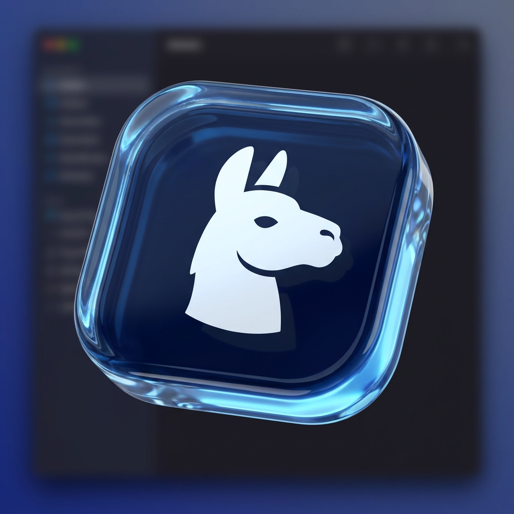
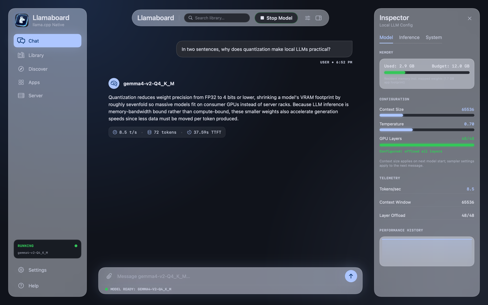
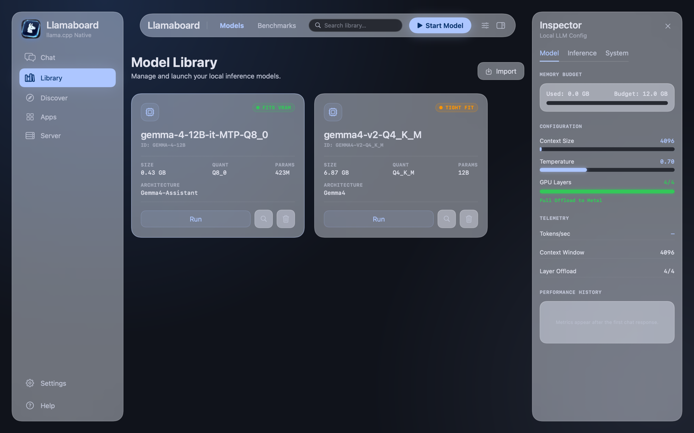
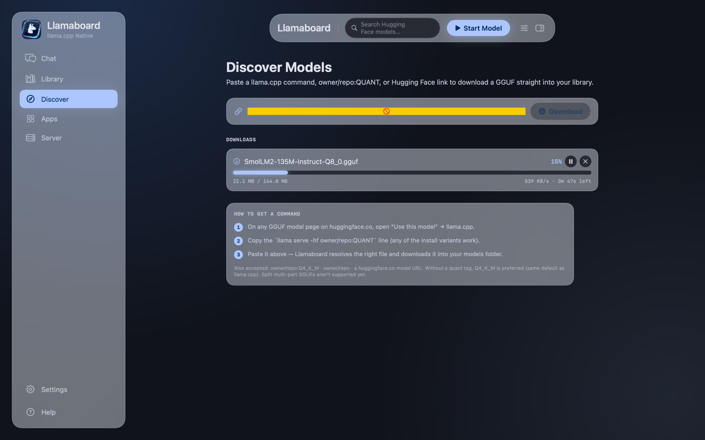
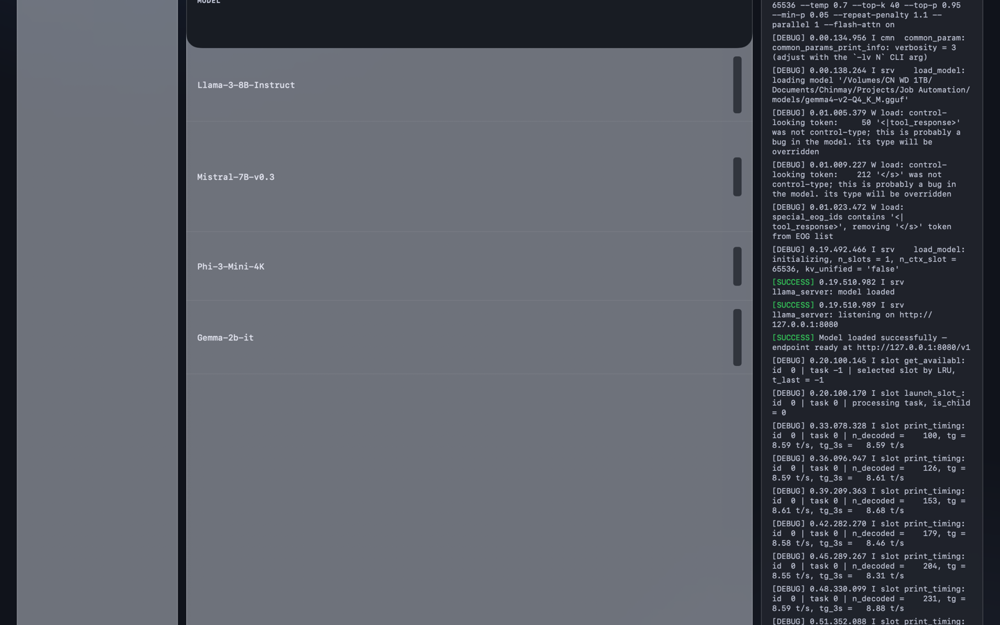
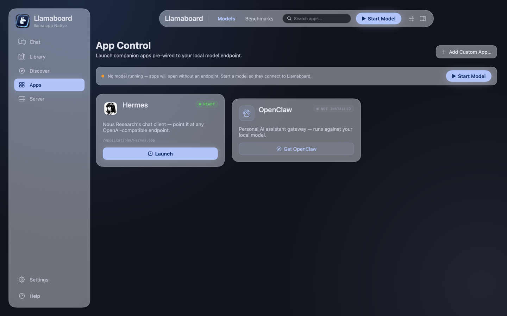
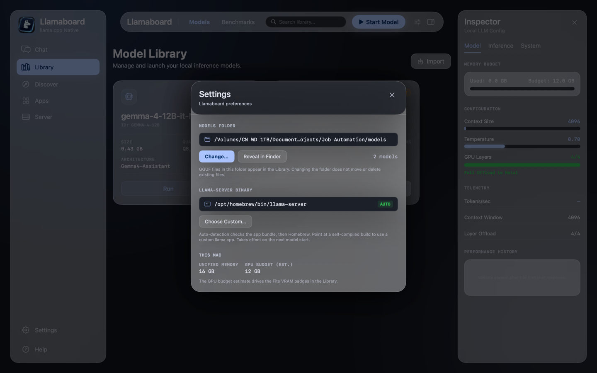

<div align="center">



# Llamaboard

**The missing Mac front end for llama.cpp.**
Manage models, tune every setting, run the server, and chat — in a native Tahoe-style app that stays out of your way.

-blue)




</div>

---

## Why Llamaboard?

Running local LLMs on a Mac today forces a choice between two bad options: raw `llama.cpp` on the command line (maximum control, zero comfort), or heavyweight Electron wrappers that hide the knobs you actually care about.

Llamaboard is the third option:

| | **Llamaboard** | LM Studio | Ollama | Jan |
|---|---|---|---|---|
| Native macOS UI | ✅ SwiftUI | ❌ Electron | ⚠️ Menu bar + CLI | ❌ Electron |
| Full llama.cpp settings in the UI | ✅ Per-model | ⚠️ Partial | ❌ Modelfiles | ⚠️ Partial |
| Plain GGUF files, user-visible | ✅ | ✅ | ❌ Blob store | ✅ |
| Honest telemetry (measured, not estimated) | ✅ | ⚠️ | ❌ | ⚠️ |
| Open source | ✅ MIT | ❌ | ⚠️ Partially | ✅ |

**Product principles:** respect the user's machine (no daemons, no phoning home, no analytics — ever in beta), progressive disclosure but never amputation (every practical `llama-server` flag is reachable), and honest numbers (the Inspector shows the *measured* process footprint and the server's *actual* `n_ctx` — not estimates dressed up as facts).

## What it does

- 📚 **Model Library** — scans a folder of plain GGUF files, parses headers natively (architecture, params, quant, context, layers) *without loading the model*, with search, size/parameter/fit filters, and a Fits-VRAM badge per model based on your unified memory.
- ⬇️ **Paste-to-download** — paste the `llama serve -hf owner/repo:QUANT` command straight from any Hugging Face model page (or a bare repo ref, or the page URL) and Llamaboard resolves the right GGUF — same quant-matching rules as llama.cpp — and downloads it into your library with progress, speed, ETA, and pause/resume/cancel.
- 🎛 **Per-model settings** — context size, temperature, full sampler set (top-k/top-p/min-p/repeat penalty), system prompt, GPU layers, KV-cache types, flash attention, port, plus a free-text escape hatch for any other flag. Stored as human-readable JSON. The UI tells you which settings apply live and which need a model restart.
- ⚡️ **One-click serve** — spawns and supervises `llama-server` (Metal), with health checks, live logs, and guaranteed teardown — no orphaned processes, ever.
- 💬 **Built-in chat** — a calm fixed-height indicator while the model generates, then the full answer rendered once, with real metrics per reply: tokens/sec, token count, time-to-first-token. No jumping transcripts.
- 📊 **Honest telemetry** — the Inspector and Server tab report the server's own `/props` values (actual `n_ctx`, with a restart-to-apply notice when your slider disagrees) and *measured* process memory — resident incl. the mmapped weights, with the app footprint alongside. Never estimates dressed up as facts.
- 🔌 **OpenAI-compatible endpoint** — everything runs through `http://127.0.0.1:8080/v1`, so IDEs, scripts, and other apps can use your running model.
- 🚀 **App Control** — launches companion apps pre-wired to your local endpoint. Hermes gets configured *automatically* (Llamaboard rewrites its provider config, with a backup); any custom app or CLI can be added.

<div align="center">
 
 

</div>

## Quick start

Requirements: Apple Silicon Mac, macOS 14+, [llama.cpp](https://github.com/ggml-org/llama.cpp) installed (bundled runtime is on the roadmap), Swift toolchain (Xcode or Command Line Tools).

```bash
brew install llama.cpp
git clone https://github.com/<you>/llamaboard.git
cd llamaboard
swift run Llamaboard
```

Drop a `.gguf` into the library (or use **Import**), press **Run**, and chat. No terminal needed after launch.

Don't have a model yet? Open **Discover** and paste this (or any `llama serve -hf …` command from a Hugging Face model page):

```
bartowski/SmolLM2-135M-Instruct-GGUF:Q4_K_M
```

It downloads straight into your library — 105 MB, loads in about a second.

## Beta 1 — what's real and what isn't

We'd rather under-promise. Everything below is labeled by how it was verified.

### ✅ Confirmed working (tested on real hardware, M4 / 16 GB)

| Area | Detail |
|---|---|
| GGUF header parsing | Architecture, name, params (from tensor table), quant, context length, layers — unit-tested against synthetic and real files (SmolLM2, Gemma) |
| Library management | Folder scan + live file watching, import via Open panel, delete with confirmation, relocatable models folder (Settings) |
| Search & filters | Live text search plus a filter popover (file size, parameter count, fits-in-memory) with active-filter badge and combined empty states |
| Paste-to-download | Parsed `llama serve -hf repo:QUANT` verbatim from HF's dialog → resolved via the hub API → 144 MB download completed with live progress/speed/ETA, pause/resume/cancel, auto-import into the Library |
| Settings profiles | Per-model JSON persistence, restart-vs-live distinction with an explicit "server is running with X — restart to apply Y" notice, context slider clamped to model max |
| Inspector tabs | Model (memory/config/telemetry), Inference (full sampler set + system prompt editor), System (hardware, endpoint, paths) |
| Server lifecycle | Start/stop, `/health` polling, error state with stderr tail, clean teardown verified — zero orphaned processes across all test runs |
| Chat | Fixed-height generating indicator, answer rendered once on completion (no transcript jumping), responsive UI during generation, stop generation, per-response metrics (289–314 t/s on SmolLM2-135M, ~8–12 t/s on an 8B-class Gemma) |
| Measured telemetry | Actual `n_ctx` from `/props` (verified matching `--ctx-size 65536`), resident memory incl. mmapped weights + app footprint sampled every 4 s, live log console |
| Settings | Models folder relocation (verified live), llama-server auto-detection via Homebrew, custom binary override path |
| App Control: Hermes | Detection, launch, and **automatic provider configuration** (`~/.hermes/config.yaml` rewrite with backup) — confirmed end-to-end with inference through the local model |
| Model alias | `/v1/models` advertises a clean model name via `--alias` |
| Branding | Stitch-designed llama glass icon as Dock icon + sidebar mark |
| Test suite | 42 assert-based unit test checks + a headless smoke test (parse → serve → chat → measured-telemetry checks → teardown) |

### ⚠️ Present but NOT yet confirmed / known limitations

| Area | Status |
|---|---|
| Hub browsing | Discover handles paste-to-download; *searching/browsing* Hugging Face inside the app is the next milestone |
| Split GGUFs | Multi-part model files (`-00001-of-000NN`) are detected and refused with a clear error — downloading them isn't supported yet |
| Bench tab | **Sample data** — llama-bench integration planned (the binary detection is already there) |
| Chat persistence | Conversations are **in-memory only** — quitting the app loses them (SQLite persistence is planned) |
| Fits-VRAM badge | Heuristic; **overestimates** KV cache for sliding-window models (Gemma family) — advisory only |
| GPU offload display | Shows *configured* layers; this Homebrew llama-server build doesn't log measured offload at default verbosity |
| Draft/MTP models | Speculative-decoding companion GGUFs (e.g. `*-MTP-*`) can't run standalone; llama-server's error is surfaced but the Library doesn't label them yet |
| Custom llama-server binary | Code path exists and is unit-tested, but not exercised against a real self-compiled build |
| OpenClaw launch | Detection + Terminal launch implemented, untested (not installed on the dev machine) |
| Env-var injection for custom apps | Depends on the target app honoring `OPENAI_BASE_URL` |
| Packaging | Runs via `swift run` — no signed/notarized `.app` bundle yet |
| Intel Macs, multimodal, LoRA, multiple concurrent models, LAN serving, gated/private HF repos | Not supported in beta 1 |

## Roadmap

Driven by [PRD.md](PRD.md) — the full product spec lives in the repo and is part of the project.

- [ ] **Beta 2:** Hugging Face hub search/browse in Discover (quant picker with RAM recommendations), split-GGUF downloads, chat persistence (SQLite), bundled llama.cpp runtime with in-app updates
- [ ] **v1.0:** Bench panel (llama-bench UI with history), menu bar mode, signed + notarized `.app`, per-conversation setting overrides, "copy as command"
- [ ] **Later:** multimodal (mmproj), LoRA adapters, multiple concurrent models, LAN serving, MLX backend

## Architecture (for contributors)

```
Sources/
├── LlamaboardKit/        # Backend library — Foundation only, no UI
│   ├── GGUFMetadata      #   native GGUF header parser
│   ├── ModelLibrary      #   folder scan + FS watching
│   ├── ServerManager     #   llama-server process supervision + measured telemetry
│   ├── ChatClient        #   SSE streaming client
│   ├── ModelSettings     #   profiles → llama-server flags
│   ├── HFDownload        #   -hf command parser, hub resolver, download manager
│   ├── HardwareInfo      #   unified-memory fits-check
│   └── HermesIntegration #   companion-app config writer
├── Llamaboard/           # SwiftUI app (Tahoe "Liquid Glass" design)
├── llamaboard-smoke/     # headless end-to-end test
└── llamaboard-tests/     # unit tests (swift run llamaboard-tests)
```

The design system came from a Stitch-generated spec (dark glass, `#adc6ff` accent, SF Pro/SF Mono); design tokens live in `Theme.swift`. A hidden `--snapshot <dir> [--live]` flag renders every screen to PNG for visual verification — the screenshots above were produced by it.

## Contributing

This project is young and the surface area is wide — perfect timing to get involved. See [CONTRIBUTING.md](CONTRIBUTING.md). Especially wanted:

- **Hub search/browse for Discover** (paste-to-download and the download manager already exist; needs the search UI + hub queries)
- **Chat persistence** (SQLite/GRDB)
- **Testing on other Macs** (M1/M2/M3, 8–128 GB — does the fits-check hold up?)
- **Companion app integrations** (know an app that speaks OpenAI-compatible? One registry entry.)

Run the tests before a PR: `swift run llamaboard-tests && swift run llamaboard-smoke <model.gguf>`

## Credits

- [llama.cpp](https://github.com/ggml-org/llama.cpp) by Georgi Gerganov and contributors — the engine this app exists to serve
- UI design generated with [Google Stitch](https://stitch.withgoogle.com), implemented natively in SwiftUI

## License

[MIT](LICENSE) — same spirit as llama.cpp. Use it, fork it, ship it.
